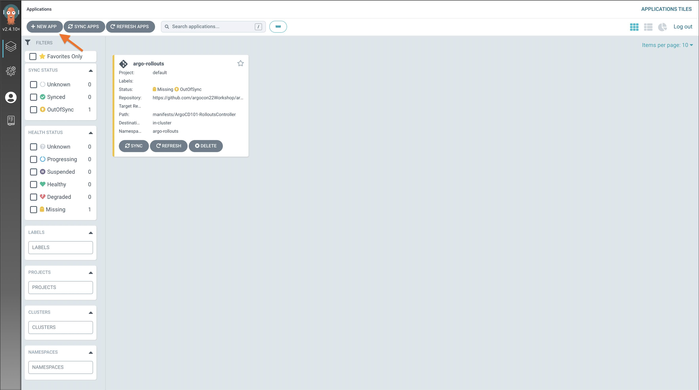
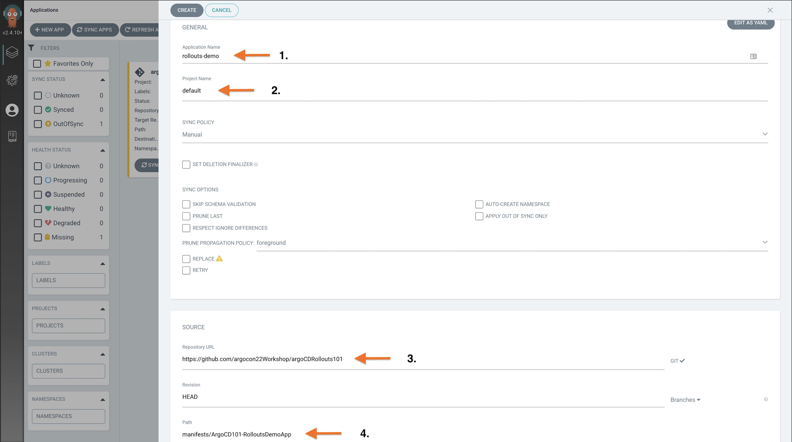
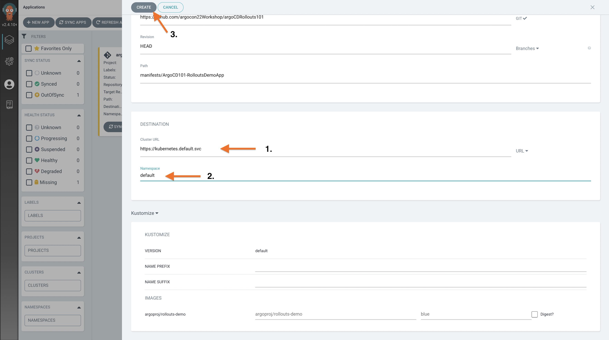

### Exercise 7: Deploying and Argo Rollouts Demo App

In this exercise we will deploy Argo Rollouts demo app and Nginx Ingress Controller via Argo CD UI.

#### Demo App Installation

1. Click on the `New App` button
   

2. Complete the application details as shown in the screenshot
   

3. Click on the `Create` button to create argo rollout application
   

4. Click on the `Sync` button within the application to deploy

5. View the Demo app at: [http://localhost:81](http://localhost:81)

Since the ingress controller is not working for me, we can port-forward the service to access the application:

```bash
kubectl port-forward svc/canary-demo 8178
```

---

### Troubleshooting Steps - 1:

If port-forwarding works but accessing through `arsene.com` doesn't, the issue likely lies within DNS resolution or the Ingress controller setup. Here's a step-by-step guide to debug this issue:

1. **DNS Resolution**: Make sure `arsene.com` resolves to the Minikube's IP address. You can add an entry in your `/etc/hosts` file (Unix/Linux) or `C:\Windows\System32\Drivers\etc\hosts` (Windows) to associate `arsene.com` with Minikube's IP.

```bash
echo "$(minikube ip) arsene.com" | sudo tee -a /etc/hosts
```

2. **Ingress Controller**: Ensure that you have an Ingress controller running in your Minikube cluster.

```bash
minikube addons enable ingress
```

3. **Check Ingress Rules**: Use `kubectl` to check the Ingress rules and ensure they are correct.

```bash
kubectl get ingress
```

4. **Ingress Logs**: You can inspect the logs for the Ingress controller to see if any errors are logged.

```bash
kubectl logs -n kube-system <ingress-controller-pod>
```

5. **Check Service & Pods**: Double-check that your services and pods are up and running.

```bash
kubectl get svc,pods
```

6. **Firewall Rules**: Ensure there are no host-level or cloud-level firewalls blocking traffic from reaching Minikube.

7. **Browser Cache**: Sometimes, DNS resolution can be cached by the browser, so try using incognito mode or another browser to access `arsene.com`.

8. **Try curl**: From a terminal, use curl to try to reach your service.

```bash
curl arsene.com
```

9. **Check Minikube IP**: Make sure the IP address in your `/etc/hosts` matches the current IP address of your Minikube VM. It could change if you stop and start the Minikube cluster.

```bash
minikube ip
```

By following these steps, you should be able to pinpoint where the issue lies.

---

### Troubleshooting Steps - 2:

1. **Check Ingress Controller**: Verify the ingress controller is running in your Minikube cluster.

```bash
kubectl get pods -n kube-system
```

    Look for the Ingress Controller pod (often starts with "nginx-ingress-controller" or similar).

2. **Enable Minikube Ingress**: If you didn't already, enable the ingress addon.

   ```bash
   minikube addons enable ingress
   ```

3. **Check Ingress Controller Logs**: Inspect the logs of the ingress controller.

```bash
kubectl logs -n kube-system [ingress-controller-pod-name]
```

4. **Describe Ingress**: Use the `describe` command for more details.

```bash
kubectl describe ingress canary-demo
```

5. **Restart Minikube**: Sometimes Minikube behaves erratically and a restart could fix the issue.

```bash
minikube stop
minikube start
```

6. **Reapply Your YAML**: After the above steps, reapply your configurations.

```bash
kubectl apply -f [your-yaml-file].yaml
```

7. **Check Hosts File**: Make sure you've set up `arsene.com` in your `/etc/hosts` file to point to your Minikube IP.

8. **Check for Errors in YAML**: Validate that there are no errors in your YAML files that could prevent the ingress controller from routing traffic.

9. **Check Minikube IP**: Confirm your Minikube IP hasn't changed. Update `/etc/hosts` if it has.

```bash
minikube ip
```

Work through these steps and hopefully, the issue should be identified and resolved.
